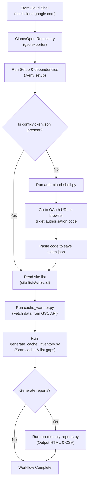

# Google Cloud Shell Automation Guide

Google Cloud Shell ([shell.cloud.google.com](https://shell.cloud.google.com)) provides a free, temporary linux container workspace with a web-based terminal, code editor, and pre-installed Google Cloud SDK. It is an ideal environment to automate your Google Search Console caching and reporting tasks without consuming local machine resources.

This guide outlines how to configure, run, and automate the GSC caching and reporting process inside Google Cloud Shell.

---

## Workflow Diagram



---

## 1. Initial Setup in Cloud Shell

When you open Google Cloud Shell, you will be in your home workspace. First, ensure you have the project files uploaded or cloned.

To prepare the environment, run:

```bash
# Navigate to the project root directory
cd ~/gsc-exporter

# Initialize virtual environment
python3 -m venv .venv
source .venv/bin/activate

# Install required dependencies
pip install --upgrade pip
pip install -r requirements.txt
```

---

## 2. Authorising with Google Search Console

Since Google Cloud Shell operates in a remote environment without a standard graphical web browser, standard OAuth loops (opening a local browser window automatically) will not succeed.

To handle this, use the specialised script [auth-cloud-shell.py](file:///home/liamvictor/projects/gsc-exporter/utilities/auth-cloud-shell.py):

```bash
python utilities/auth-cloud-shell.py
```

### Steps to Authenticate:
1. Copy the authentication URL printed in the terminal and open it in your browser.
2. Select your Google account that has access to your target GSC properties and grant the requested permissions.
3. Your browser will redirect to `http://localhost:8080` and display a "This site can’t be reached" error.
4. **Do not close the tab!** Look at the browser's address bar and copy the full text of the `code` parameter (the text following `code=`).
5. Paste that code back into the Cloud Shell terminal prompt and press `Enter`.
6. This saves the authenticated token file to `config/token.json`.

> [!IMPORTANT]
> The generated token will automatically request offline access, creating a refresh token. This allows future script runs to run in the background without needing you to log in or authorise again.

---

## 3. Automation Script: `cloud-shell-automate.sh`

To simplify execution, we created [cloud-shell-automate.sh](file:///home/liamvictor/projects/gsc-exporter/cloud-shell-automate.sh) in the project root. This shell script handles environment checks, token validation, caching, and reporting in a single execution.

### Basic Interactive Usage
Simply run the script to warm the cache interactively:
```bash
./cloud-shell-automate.sh
```

### Non-Interactive Automation (Cron-ready)
To run the script automatically in the background (such as a cron job or startup script) without human interaction, pass the `--non-interactive` flag. You can also specify an alternate sites file or run reports automatically:

```bash
# Run caching and reports silently on a custom site list
./cloud-shell-automate.sh --non-interactive --run-reports --sites-file site-lists/my-sites.txt
```

---

## 4. Scheduling Automated Cache Collection

To ensure your local GSC data cache stays warm and up-to-date, you can schedule the automation script.

### Using Cloud Shell Cron
Because Google Cloud Shell instances go to sleep after 20–30 minutes of inactivity, scheduling a traditional internal `cron` job will only trigger while you actively have the terminal open. 

However, you can configure standard cron within active sessions or use external trigger scripts (like Google Cloud Scheduler triggering a Compute Engine VM or Cloud Run job).

If running a persistent session, configure cron:
1. Open the cron editor:
   ```bash
   crontab -e
   ```
2. Add a line to run the automation script every Monday morning at 4:00 AM:
   ```cron
   0 4 * * 1 /bin/bash /home/liamvictor/projects/gsc-exporter/cloud-shell-automate.sh --non-interactive --run-reports >> /home/liamvictor/projects/gsc-exporter/cache-run.log 2>&1
   ```

> [!TIP]
> For production automation, it is recommended to run this project on a small Google Compute Engine (GCE) micro-instance. The credentials in `config/token.json` and [cloud-shell-automate.sh](file:///home/liamvictor/projects/gsc-exporter/cloud-shell-automate.sh) are fully portable and will run identically on any Linux server.

---

## 5. Investigating Cache Integrity and Generating Reports

After the script runs, check the completeness of your GSC cache files using the inventory script:

```bash
# Generate a detailed html & csv analysis in output/account/
python utilities/generate_cache_inventory.py --sites-file site-lists/sites.txt
```

This updates files like `output/account/cache-inventory-sites-YYYY-MM.html`, which you can view to identify any gaps. If gaps exist, run:
```bash
# Run monthly reports to create CSV/HTML data for the cached month
python run-monthly-reports.py --sites-file site-lists/sites.txt --last-month
```
All monthly output files will be compiled cleanly under `output/<property-name>/`.
